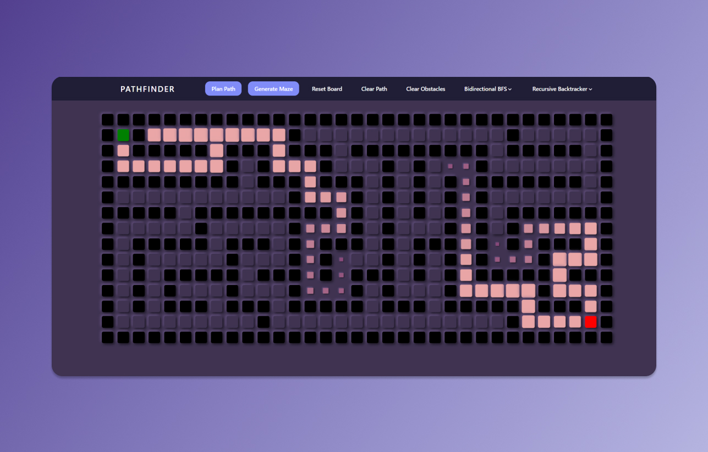

<span title="Pathplanning Visualizer">
 <p align="center">
  
 </p>
</span>

# Pathfinding Visualizer

[](https://github.com/Yyassin/PathfindingVisualizer/stargazers) [](https://raw.githubusercontent.com/Yyassin/Stockpreme/master/LICENSE)

> **Pathfinding Visualizer** is a website that allows for the visualization of common pathplanning and maze generation algorithms. The algorithms are applied to a grid of nodes that is animated to convey the algorithm's progression. **Visit the live site [here](https://yyassin.github.io/PathfindingVisualizer/)**.

## Minimum Requirements:

-   Windows 7 or later
-   Node.js >12
-   Yarn >1.2x

## Running Project

You will first need to clone the repository to your local machine:

```
git clone https://github.com/Yyassin/PathfindingVisualizer
```

-   Install [Node js](https://nodejs.org/en/) version 12.x or later.

-   Install [Yarn](https://classic.yarnpkg.com/en/docs/install/#windows-stable) version 1.2x or later.

-   Navigate to the appropriate directory from terminal:

```
cd ~/PathfindingVisualizer
```

-   Install the required dependencies in the root folder with npm or yarn:

```
npm i or yarn install
```

-   Run the main client file with yarn:

```
yarn start
```

-   Enjoy! 🎉

## Features

-   Visualize the implementation of various path planning algorithms:

    -   Astar (A*)
    -   Djikstra
    -   Greedy
    -   Swarm
    -   Breadth-First Search (BFS)
    -   Bidirectional BFS
    -   Depth-First Search (DFS)

-   Visualize the implementation of 2 maze-generation algorithms (more planned for a future update):

    -   Recursive Backtracking
    -   Random

## Usage

- Use the top tool panel to select both a path finding and maze-generation algorithm.
- Generate a maze or begin path planning with the appropriate button on the tool panel.
- Click and drag the start and end positions to change their locations.
- Click (and drag) on the grid to add walls, hold w to add weights (only for weighted algorithms - astar, djikstra and greedy).
- Select the appropriate button on the tool panel to clear / reset aspects of the grid.

## Next Steps

- Looking to improve the UX by adding a legend for the different types of nodes, indication of the selected node and a short tutorial.
- There are still a few more maze-generation and path-planning algorithms to add:
  - **Maze**:
    - Kruskal's Algorithm
    - Prim's Algorithm
    - Recursive Division
  
  - **Path-planning**:
    - Orthogonal Jump-Point
    - Trace
    - Iterative Deepening Depth
    - IDA*
    - Multinodal paths (destination nodes between start and end).